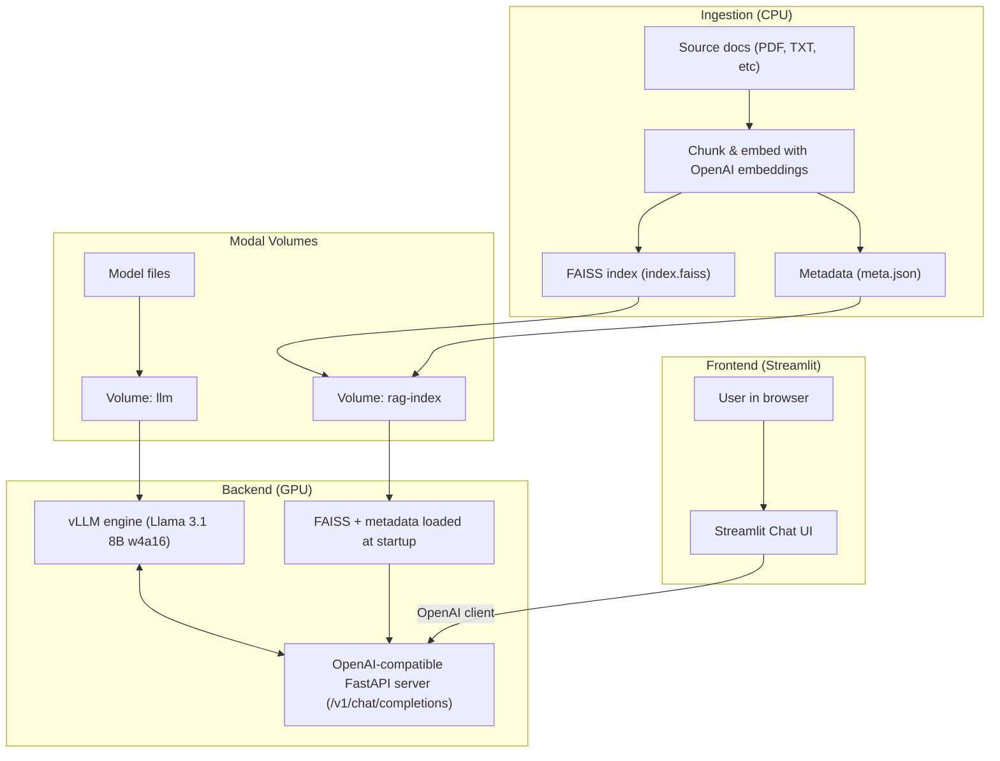

# vLLM RAG Chat on Modal

End-to-end Retrieval Augmented Generation (RAG) stack:

- **Model:** Quantized Meta-Llama-3.1-8B-Instruct (w4a16) served with **vLLM**
- **Infra:** **Modal** GPU app for the LLM + RAG, CPU app for ingestion
- **Embeddings:** `text-embedding-3-small` (OpenAI)
- **Vector index:** **FAISS** stored on a Modal Volume
- **Frontend:** **Streamlit** chat UI talking to an OpenAI-compatible endpoint

---
[Watch the demo ▶️](https://www.loom.com/share/270222a0b6fd4a199e5bf46b1fa71b01)

## High-level architecture

## Acknowledgements

This project was initially inspired by the Udemy course "Production LLM Deployment: vLLM,FastAPI,Modal and AI Chatbot" by Petar Petkanov (Not affiliated or sponsored in any way).
I used it to learn the basics of Modal apps and vLLM, then extended it.

